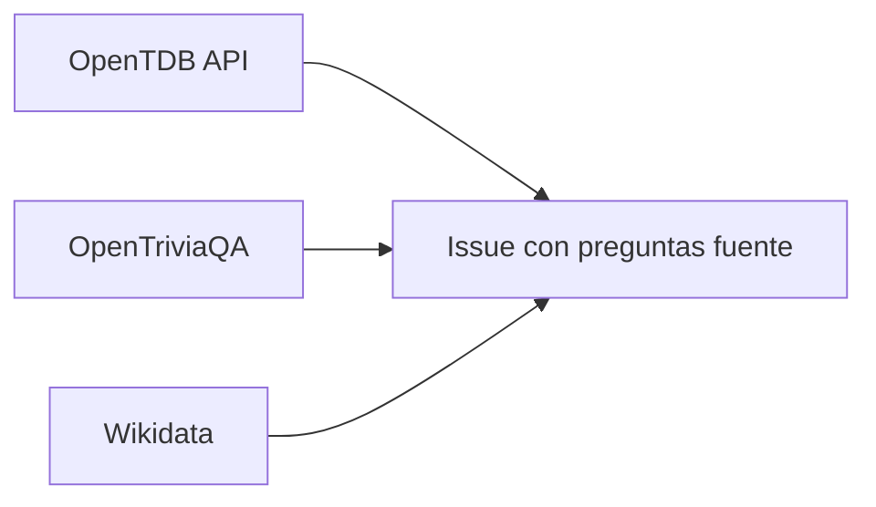

# 📚 Fuentes de Preguntas - World Exams

> Documentación oficial de todas las fuentes utilizadas para generar preguntas educativas.

---

## ✅ Fuentes Verificadas y Aprobadas

### 1. Open Trivia Database (OpenTDB)

| Atributo | Valor |
|----------|-------|
| **URL** | https://opentdb.com |
| **API Docs** | https://opentdb.com/api_config.php |
| **Licencia** | CC BY-SA 4.0 |
| **Uso Comercial** | ✅ Permitido |
| **Atribución Requerida** | ✅ Sí |
| **Idioma Original** | Inglés |
| **Preguntas Disponibles** | ~4,000 |
| **Límite API** | 50 preguntas por request, sin auth |

**Categorías disponibles:**
- Science & Nature (ID: 17)
- Mathematics (ID: 19)
- History (ID: 23)
- Geography (ID: 22)
- General Knowledge (ID: 9)
- Computers (ID: 18)
- Art (ID: 25)
- Politics (ID: 24)

**Ejemplo de uso:**
```bash
curl "https://opentdb.com/api.php?amount=10&category=19&type=multiple"
```

**Atribución obligatoria:**
```yaml
source: "OpenTDB"
source_url: "https://opentdb.com"
source_license: "CC BY-SA 4.0"
```

---

### 2. OpenTriviaQA (GitHub Dataset)

| Atributo | Valor |
|----------|-------|
| **URL** | https://github.com/uberspot/OpenTriviaQA |
| **Licencia** | CC BY-SA 4.0 |
| **Uso Comercial** | ✅ Permitido |
| **Atribución Requerida** | ✅ Sí |
| **Idioma Original** | Inglés |
| **Preguntas Disponibles** | ~10,000 |
| **Formato** | Archivos de texto plano |

**Categorías disponibles:**
- General Knowledge
- Science & Nature
- Sports & Leisure
- Entertainment
- History
- Geography

**Formato de preguntas:**
```
#Q A question until the newline
^ The text of the correct answer
A multiple choice answer 1
B multiple choice answer 2
C multiple choice answer 3
D ....
```

**Atribución obligatoria:**
```yaml
source: "OpenTriviaQA"
source_url: "https://github.com/uberspot/OpenTriviaQA"
source_license: "CC BY-SA 4.0"
```

---

### 3. Wikidata / Wikipedia

| Atributo | Valor |
|----------|-------|
| **URL** | https://www.wikidata.org |
| **Licencia** | CC0 (datos) / CC BY-SA 3.0 (textos) |
| **Uso Comercial** | ✅ Permitido |
| **Atribución Requerida** | Recomendada |
| **Idiomas** | Multilingüe |
| **Datos Disponibles** | Ilimitados |

**Uso:** Generación de preguntas basadas en datos factuales (capitales, fechas históricas, datos científicos).

**Atribución obligatoria:**
```yaml
source: "Wikidata"
source_url: "https://www.wikidata.org"
source_license: "CC0 / CC BY-SA 3.0"
```

---

## ⚠️ Fuentes con Restricciones

### The Trivia API

| Atributo | Valor |
|----------|-------|
| **URL** | https://the-trivia-api.com |
| **Licencia** | CC BY-NC 4.0 |
| **Uso Comercial** | ❌ Prohibido sin suscripción |
| **Plan Gratuito** | Solo uso no comercial |

**Nota:** Solo usar para proyectos personales o educativos sin fines de lucro.

---

### QuizAPI

| Atributo | Valor |
|----------|-------|
| **URL** | https://quizapi.io |
| **Licencia** | Propietaria |
| **Uso Comercial** | ❌ Requiere suscripción |
| **Plan Gratuito** | Limitado, requiere API key |

**Nota:** Enfocado en tecnología (PHP, Docker, Linux). No usar sin permiso explícito.

---

## 📝 Formato de Atribución Estándar

Toda pregunta generada DEBE incluir en su frontmatter:

```yaml
---
# ... otros campos ...

# ATRIBUCIÓN (OBLIGATORIO)
source: "Nombre de la fuente"
source_url: "URL de la fuente"
source_license: "Tipo de licencia"
inspired_by: "Pregunta original (opcional)"
generation_method: "variation" | "translation" | "original"
generation_date: "YYYY-MM-DD"
---
```

---

## 🔄 Proceso de Generación

### Paso 1: Obtención de Fuentes


### Paso 2: Generación de Variaciones
- Por cada pregunta fuente, se generan **6 variaciones**
- Cada variación mantiene el concepto pero cambia:
  - Valores numéricos
  - Nombres/lugares
  - Contexto cultural (adaptado al país)
  - Nivel de dificultad

### Paso 3: Integración
- Las variaciones se crean como archivos Markdown
- Se ubican en: `src/content/questions/[país]/[asignatura]/grado-[N]/[tema]/`
- Se hace commit automático con atribución

---

## 📊 Métricas de Uso

| Fuente | Preguntas Extraídas | Variaciones Generadas | Fecha Última Sync |
|--------|--------------------:|----------------------:|-------------------|
| OpenTDB | 89 | ~534 (pendientes) | 2025-12-04 |
| OpenTriviaQA | 0 | 0 | - |
| Wikidata | 0 | 0 | - |

---

## 🔗 Referencias Legales

- [Creative Commons BY-SA 4.0](https://creativecommons.org/licenses/by-sa/4.0/)
- [Creative Commons BY-NC 4.0](https://creativecommons.org/licenses/by-nc/4.0/)
- [CC0 Public Domain](https://creativecommons.org/publicdomain/zero/1.0/)

---

*Última actualización: 2025-12-04*
