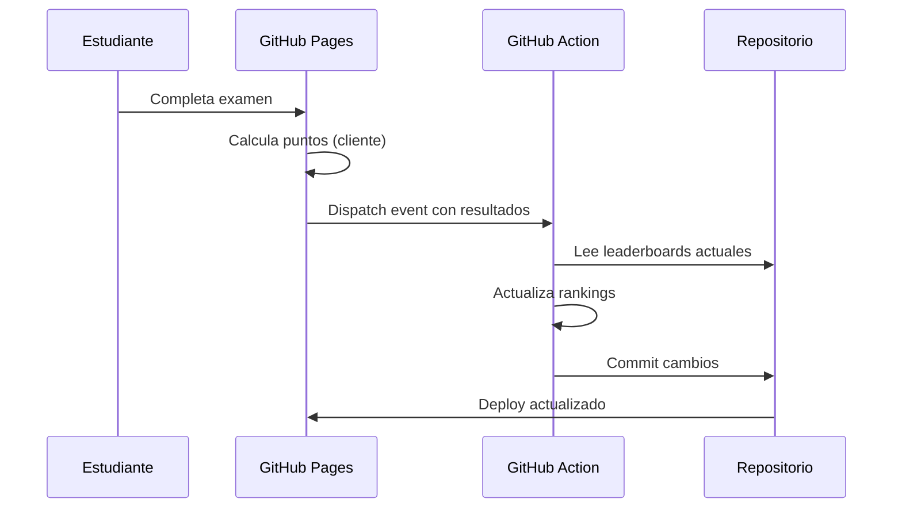

# 🏆 Sistema de Puntos y Leaderboards - World Exams

_Versión: 1.0 | Fecha: 2025-12-05_

---

## 📋 Resumen Ejecutivo

Este documento describe el sistema de puntuación para la plataforma World Exams, diseñado para:

1. **Calcular puntos** basados en dificultad, precisión y consistencia
2. **Generar identidades anónimas** para proteger datos de estudiantes
3. **Mantener leaderboards** con automatización controlada; no asumir GitHub Actions como ruta activa
4. **Soportar múltiples períodos** adaptados al calendario colombiano

---

## 🎯 Fórmula de Puntuación

### Puntos por Pregunta Individual

```
PuntosPregunta = BasePoints × DifficultyMultiplier × TimeBonus × StreakMultiplier
```

#### Componentes:

| Componente | Fórmula | Descripción |
|------------|---------|-------------|
| **BasePoints** | 100 | Puntos base por pregunta correcta |
| **DifficultyMultiplier** | `0.6 + (dificultad × 0.2)` | Multiplica según nivel 1-5 |
| **TimeBonus** | `max(1.0, 1.5 - (segundos/120))` | Bonus por responder rápido (máx 1.5x) |
| **StreakMultiplier** | `1 + (streak × 0.1)` | Bonus por racha de aciertos (máx 2.0x) |

#### Tabla de Multiplicadores por Dificultad:

| Dificultad | Nombre | Multiplicador | Puntos Base Resultante |
|------------|--------|---------------|------------------------|
| 1 | Muy fácil | 0.8 | 80 pts |
| 2 | Fácil | 1.0 | 100 pts |
| 3 | Media | 1.2 | 120 pts |
| 4 | Difícil | 1.4 | 140 pts |
| 5 | Muy difícil | 1.6 | 160 pts |

#### Ejemplos de Cálculo:

**Ejemplo 1:** Pregunta dificultad 3, respuesta en 30 segundos, racha de 5
```
Base = 100
Difficulty = 0.6 + (3 × 0.2) = 1.2
TimeBonus = max(1.0, 1.5 - 0.25) = 1.25
Streak = 1 + (5 × 0.1) = 1.5

Total = 100 × 1.2 × 1.25 × 1.5 = 225 puntos
```

**Ejemplo 2:** Pregunta dificultad 5, respuesta en 90 segundos, sin racha
```
Base = 100
Difficulty = 0.6 + (5 × 0.2) = 1.6
TimeBonus = max(1.0, 1.5 - 0.75) = 1.0
Streak = 1 + (0 × 0.1) = 1.0

Total = 100 × 1.6 × 1.0 × 1.0 = 160 puntos
```

### Puntos por Respuesta Incorrecta

```
PuntosIncorrectos = -20 × DifficultyMultiplier
```

- Penalización leve para desincentivar respuestas al azar
- Máximo: -32 puntos (dificultad 5)
- Mínimo: -16 puntos (dificultad 1)

### Puntuación de Examen Completo

```
PuntuajeExamen = Σ(PuntosPregunta) + BonusCompletion + BonusAccuracy
```

| Bonus | Condición | Puntos |
|-------|-----------|--------|
| **BonusCompletion** | Terminar todas las preguntas | +50 |
| **BonusAccuracy** | Precisión ≥ 80% | +(accuracy - 0.8) × 200 |
| **BonusPerfect** | Precisión = 100% | +100 extra |

---

## 🎭 Sistema de Identidad Anónima

### Datos de Entrada

El estudiante proporciona:
1. **Nombre** (solo primer nombre)
2. **Ciudad** (de una lista predefinida)
3. **Colegio** (nombre corto o iniciales)
4. **Curso** (formato: 11-A, 9-B, etc.)

### Algoritmo de Generación de ID

```typescript
function generateAnonymousId(nombre: string, ciudad: string, colegio: string, curso: string): string {
  // 1. Tomar iniciales
  const inicialNombre = nombre.charAt(0).toUpperCase();
  const inicialCiudad = ciudad.substring(0, 3).toUpperCase();
  const inicialColegio = colegio.substring(0, 2).toUpperCase();

  // 2. Extraer grado
  const grado = curso.split('-')[0];

  // 3. Hash corto para unicidad (últimos 4 chars del hash)
  const dataString = `${nombre}${ciudad}${colegio}${curso}`.toLowerCase();
  const hash = simpleHash(dataString).toString(36).slice(-4).toUpperCase();

  // 4. Generar apodo aleatorio de animal + adjetivo
  const animal = ANIMALES[hashToIndex(dataString, ANIMALES.length)];
  const adjetivo = ADJETIVOS[hashToIndex(dataString + 'adj', ADJETIVOS.length)];

  // Formato: "AguiLaVeloz_BOG_11_X7K2"
  return `${adjetivo}${animal}_${inicialCiudad}_${grado}_${hash}`;
}
```

### Ejemplos de IDs Generados

| Datos Entrada | ID Anónimo |
|---------------|------------|
| Juan, Bogotá, San Bartolomé, 11-A | `VelozAguila_BOG_11_K7F2` |
| María, Medellín, Colegio Mayor, 9-B | `AgilJaguar_MED_9_P3X1` |
| Carlos, Cali, INEM, 5-C | `RapidoOso_CAL_5_M2N8` |
| Ana, Barranquilla, Liceo, 3-A | `BrillanteColibri_BAR_3_T5V9` |

### Diccionarios para Apodos

```typescript
const ANIMALES = [
  'Aguila', 'Jaguar', 'Condor', 'Oso', 'Tigre', 'Leon', 'Colibri',
  'Delfin', 'Lobo', 'Halcon', 'Tucan', 'Pantera', 'Buho', 'Serpiente',
  'Tortuga', 'Cocodrilo', 'Armadillo', 'Mapache', 'Zorro', 'Puma'
];

const ADJETIVOS = [
  'Veloz', 'Agil', 'Rapido', 'Brillante', 'Astuto', 'Fuerte',
  'Sabio', 'Audaz', 'Noble', 'Valiente', 'Certero', 'Tenaz',
  'Sereno', 'Firme', 'Sagaz', 'Perspicaz', 'Diestro', 'Ingenioso'
];
```

### Recuperación de Identidad

El estudiante puede verificar que es él ingresando los mismos 4 datos:
- Si coincide el hash → mismo ID → sus puntos

⚠️ **Importante:**
- No se almacena información personal, solo el hash resultante
- El estudiante debe recordar sus datos para verificar identidad
- Colisiones son posibles pero muy raras (1 en ~1.7 millones combinaciones)

---

## 📅 Períodos de Leaderboard

### Calendarios Académicos de Colombia

Colombia tiene **dos calendarios escolares**:

| Calendario | Meses Académicos | Vacaciones |
|------------|------------------|------------|
| **Calendario A** | Febrero - Noviembre | Dic-Ene |
| **Calendario B** | Septiembre - Junio | Jul-Ago |

### Períodos Soportados

| Período | Duración | Archivo | Reset |
|---------|----------|---------|-------|
| **Semanal** | Lunes a Domingo | `leaderboard-weekly.json` | Cada lunes 00:00 |
| **Mensual** | Día 1 al último del mes | `leaderboard-monthly.json` | Día 1 de cada mes |
| **Semestral A** | Feb-Jun / Jul-Nov | `leaderboard-semester-a.json` | Feb 1 / Jul 1 |
| **Semestral B** | Sep-Dic / Ene-Jun | `leaderboard-semester-b.json` | Sep 1 / Ene 1 |
| **Anual** | Ene 1 - Dic 31 | `leaderboard-annual.json` | Ene 1 |
| **Histórico** | Todo el tiempo | `leaderboard-alltime.json` | Nunca |

### Lógica de Reset

```typescript
function shouldReset(period: string, lastReset: Date, now: Date): boolean {
  switch(period) {
    case 'weekly':
      return getWeekNumber(now) !== getWeekNumber(lastReset);
    case 'monthly':
      return now.getMonth() !== lastReset.getMonth();
    case 'semester-a':
      // Semestre 1: Feb-Jun, Semestre 2: Jul-Nov
      const semA1 = now.getMonth() >= 1 && now.getMonth() <= 5;
      const lastSemA1 = lastReset.getMonth() >= 1 && lastReset.getMonth() <= 5;
      return semA1 !== lastSemA1;
    case 'semester-b':
      // Semestre 1: Sep-Dic, Semestre 2: Ene-Jun
      const semB1 = now.getMonth() >= 8;
      const lastSemB1 = lastReset.getMonth() >= 8;
      return semB1 !== lastSemB1;
    case 'annual':
      return now.getFullYear() !== lastReset.getFullYear();
    default:
      return false;
  }
}
```

---

## 📁 Estructura de Archivos

### Ubicación en el Repositorio

```
public/
└── leaderboards/
    ├── config.json              # Configuración del sistema
    ├── leaderboard-weekly.json
    ├── leaderboard-monthly.json
    ├── leaderboard-semester-a.json
    ├── leaderboard-semester-b.json
    ├── leaderboard-annual.json
    ├── leaderboard-alltime.json
    └── archive/                 # Histórico de períodos anteriores
        ├── 2025/
        │   ├── weekly/
        │   │   ├── week-01.json
        │   │   └── ...
        │   └── monthly/
        │       ├── january.json
        │       └── ...
        └── ...
```

### Schema de Leaderboard

```json
{
  "$schema": "./leaderboard.schema.json",
  "version": "1.0",
  "period": "weekly",
  "periodStart": "2025-12-02T00:00:00Z",
  "periodEnd": "2025-12-08T23:59:59Z",
  "lastUpdated": "2025-12-05T15:30:00Z",
  "totalParticipants": 1247,
  "entries": [
    {
      "rank": 1,
      "anonymousId": "VelozAguila_BOG_11_K7F2",
      "displayName": "🦅 Veloz Águila",
      "score": 15750,
      "stats": {
        "questionsAnswered": 120,
        "accuracy": 0.875,
        "averageDifficulty": 3.2,
        "longestStreak": 15,
        "examsCompleted": 8,
        "perfectScores": 2
      },
      "grade": "11",
      "region": "BOG",
      "lastActive": "2025-12-05T14:22:00Z"
    },
    {
      "rank": 2,
      "anonymousId": "AgilJaguar_MED_9_P3X1",
      "displayName": "🐆 Ágil Jaguar",
      "score": 14200,
      "stats": {
        "questionsAnswered": 95,
        "accuracy": 0.92,
        "averageDifficulty": 3.8,
        "longestStreak": 22,
        "examsCompleted": 6,
        "perfectScores": 1
      },
      "grade": "9",
      "region": "MED",
      "lastActive": "2025-12-05T13:45:00Z"
    }
  ],
  "metadata": {
    "topGrade": "11",
    "topRegion": "BOG",
    "averageScore": 3420,
    "averageAccuracy": 0.72
  }
}
```

### Schema de Configuración

```json
{
  "version": "1.0",
  "scoring": {
    "basePoints": 100,
    "difficultyMultipliers": [0.8, 1.0, 1.2, 1.4, 1.6],
    "timeBonus": {
      "maxMultiplier": 1.5,
      "decaySeconds": 120
    },
    "streakBonus": {
      "incrementPerStreak": 0.1,
      "maxMultiplier": 2.0
    },
    "incorrectPenalty": -20,
    "completionBonus": 50,
    "accuracyBonusThreshold": 0.8,
    "accuracyBonusMultiplier": 200,
    "perfectBonus": 100
  },
  "periods": {
    "weekly": { "enabled": true, "topN": 100 },
    "monthly": { "enabled": true, "topN": 100 },
    "semesterA": { "enabled": true, "topN": 200 },
    "semesterB": { "enabled": true, "topN": 200 },
    "annual": { "enabled": true, "topN": 500 },
    "alltime": { "enabled": true, "topN": 1000 }
  },
  "regions": [
    "BOG", "MED", "CAL", "BAR", "CAR", "BUC", "PER", "MAN",
    "SMA", "IBA", "CUC", "SOL", "VIL", "NEI", "MON", "PAS",
    "ARM", "VAL", "POP", "SIN", "TUN", "FLO", "RIO", "QUI"
  ],
  "lastUpdated": "2025-12-05T00:00:00Z"
}
```

---

## 🔄 Workflow Histórico de Automatización

### Flujo de Actualización



### Trigger via Repository Dispatch

El frontend envía resultados usando `repository_dispatch`:

```typescript
// En el cliente (después de completar examen)
async function submitScore(data: ScoreSubmission) {
  const response = await fetch(
    'https://api.github.com/repos/worldexams/saberparatodos/dispatches',
    {
      method: 'POST',
      headers: {
        'Accept': 'application/vnd.github.v3+json',
        'Authorization': `Bearer ${PUBLIC_GITHUB_TOKEN}` // Token con solo dispatch perms
      },
      body: JSON.stringify({
        event_type: 'score_submission',
        client_payload: {
          anonymousId: data.anonymousId,
          score: data.score,
          stats: data.stats,
          timestamp: new Date().toISOString()
        }
      })
    }
  );
}
```

### Workflow: update-leaderboards.yml

```yaml
name: Update Leaderboards

on:
  repository_dispatch:
    types: [score_submission]
  schedule:
    # Actualización periódica cada hora para consolidar
    - cron: '0 * * * *'
  workflow_dispatch:
    inputs:
      force_reset:
        description: 'Forzar reset de período'
        required: false
        default: 'false'

permissions:
  contents: write

jobs:
  update:
    runs-on: ubuntu-latest
    steps:
      - uses: actions/checkout@v4

      - uses: actions/setup-node@v4
        with:
          node-version: '20'

      - name: Install dependencies
        run: npm ci

      - name: Update Leaderboards
        run: node scripts/update-leaderboards.js
        env:
          SUBMISSION_DATA: ${{ toJson(github.event.client_payload) }}
          FORCE_RESET: ${{ github.event.inputs.force_reset || 'false' }}

      - name: Commit changes
        run: |
          git config user.name 'github-actions[bot]'
          git config user.email 'github-actions[bot]@users.noreply.github.com'
          git add public/leaderboards/
          git diff --staged --quiet || git commit -m "📊 Update leaderboards [skip ci]"
          git push
```

---

## 🛡️ Seguridad y Anti-Cheating

### Medidas Implementadas

1. **Solo Actions puede escribir:** Los archivos de leaderboard están protegidos
2. **Validación de scores:** El Action valida que los puntos sean posibles
3. **Rate limiting:** Máximo 1 submission por minuto por ID
4. **Detección de anomalías:**
   - Score > máximo teórico → rechazado
   - Tiempo < mínimo humanamente posible → rechazado
   - Patrón de respuestas sospechoso → flag para revisión

### Límites de Score

```typescript
const MAX_POINTS_PER_QUESTION = 100 * 1.6 * 1.5 * 2.0; // 480 pts
const MIN_TIME_PER_QUESTION = 3; // segundos (anti-bot)
const MAX_SUBMISSIONS_PER_HOUR = 10;

function validateSubmission(data: ScoreSubmission): boolean {
  // Validar score máximo teórico
  const maxPossible = data.stats.questionsAnswered * MAX_POINTS_PER_QUESTION;
  if (data.score > maxPossible) return false;

  // Validar tiempo mínimo
  const minTimeTotal = data.stats.questionsAnswered * MIN_TIME_PER_QUESTION;
  if (data.timeSpent < minTimeTotal) return false;

  // Validar precisión vs score
  if (data.stats.accuracy === 0 && data.score > 0) return false;

  return true;
}
```

---

## 📱 Implementación Frontend

### Componente de Registro de ID

```svelte
<!-- IdentityRegistration.svelte -->
<script lang="ts">
  import { generateAnonymousId, saveLocalIdentity } from '$lib/identity';

  let nombre = $state('');
  let ciudad = $state('');
  let colegio = $state('');
  let curso = $state('');
  let generatedId = $state('');

  function handleGenerate() {
    if (nombre && ciudad && colegio && curso) {
      generatedId = generateAnonymousId(nombre, ciudad, colegio, curso);
      saveLocalIdentity(generatedId, { nombre, ciudad, colegio, curso });
    }
  }
</script>

<div class="identity-form">
  <input bind:value={nombre} placeholder="Tu primer nombre" />
  <select bind:value={ciudad}>
    <option value="">Selecciona tu ciudad</option>
    <option value="Bogotá">Bogotá</option>
    <option value="Medellín">Medellín</option>
    <!-- ... más ciudades -->
  </select>
  <input bind:value={colegio} placeholder="Nombre corto del colegio" />
  <input bind:value={curso} placeholder="Curso (ej: 11-A)" />

  <button onclick={handleGenerate}>Generar mi ID anónimo</button>

  {#if generatedId}
    <div class="generated-id">
      <p>Tu ID: <strong>{generatedId}</strong></p>
      <p class="hint">Guarda estos datos para recuperar tu identidad</p>
    </div>
  {/if}
</div>
```

### Componente de Leaderboard

```svelte
<!-- Leaderboard.svelte -->
<script lang="ts">
  import type { LeaderboardEntry } from '$lib/types';

  interface Props {
    period: 'weekly' | 'monthly' | 'annual' | 'alltime';
    entries: LeaderboardEntry[];
    currentUserId?: string;
  }

  let { period, entries, currentUserId }: Props = $props();

  const periodLabels = {
    weekly: 'Esta semana',
    monthly: 'Este mes',
    annual: 'Este año',
    alltime: 'Histórico'
  };
</script>

<div class="leaderboard">
  <h2>{periodLabels[period]}</h2>

  <table>
    <thead>
      <tr>
        <th>#</th>
        <th>Jugador</th>
        <th>Puntos</th>
        <th>Precisión</th>
      </tr>
    </thead>
    <tbody>
      {#each entries as entry}
        <tr class:highlight={entry.anonymousId === currentUserId}>
          <td class="rank">{entry.rank}</td>
          <td class="player">
            <span class="display-name">{entry.displayName}</span>
            <span class="region">{entry.region}</span>
          </td>
          <td class="score">{entry.score.toLocaleString()}</td>
          <td class="accuracy">{(entry.stats.accuracy * 100).toFixed(1)}%</td>
        </tr>
      {/each}
    </tbody>
  </table>
</div>
```

---

## 🚀 Plan de Implementación

### Fase 1: Core (Semana 1)

- [ ] Crear schema de TypeScript para tipos
- [ ] Implementar `generateAnonymousId()`
- [ ] Implementar `calculateScore()`
- [ ] Crear archivos JSON iniciales vacíos

### Fase 2: GitHub Action (Semana 2)

- [ ] Crear `update-leaderboards.yml`
- [ ] Crear script `scripts/update-leaderboards.js`
- [ ] Configurar repository dispatch token
- [ ] Probar flujo completo

### Fase 3: Frontend (Semana 3)

- [ ] Componente `IdentityRegistration.svelte`
- [ ] Componente `Leaderboard.svelte`
- [ ] Integrar con `ExamView.svelte`
- [ ] Persistencia local (localStorage)

### Fase 4: Polish (Semana 4)

- [ ] Página dedicada `/leaderboard`
- [ ] Filtros por grado y región
- [ ] Animaciones y celebraciones
- [ ] Badges y achievements

---

## ❓ FAQ

### ¿Puedo cambiar mi nombre después?
No directamente. Deberías crear un nuevo ID, perdiendo el historial anterior.

### ¿Qué pasa si dos personas tienen el mismo ID?
Es muy improbable (1 en millones), pero de ocurrir, sus puntos se sumarían. Se recomienda usar datos precisos.

### ¿Cómo sé que mis puntos se guardaron?
Verás tu ID aparecer en el leaderboard después del siguiente ciclo de actualización (máximo 1 hora).

### ¿Los leaderboards son por país?
Sí. Cada repositorio de país (`saberparatodos`, `exani-mx`, etc.) tiene sus propios leaderboards independientes.

### ¿Puedo ver el histórico de leaderboards pasados?
Sí, en la carpeta `public/leaderboards/archive/` se guardan los leaderboards de períodos anteriores.

---

_Documento creado: 2025-12-05 | Autor: GitHub Copilot | Proyecto: World Exams_
